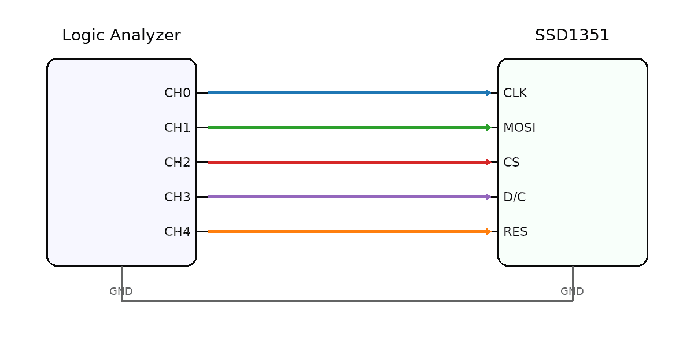
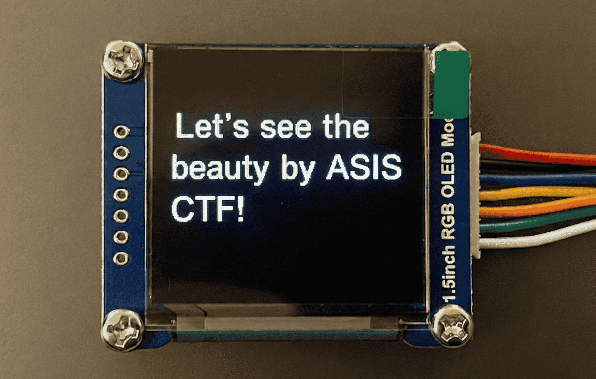
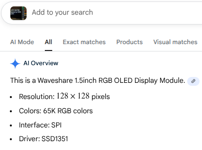
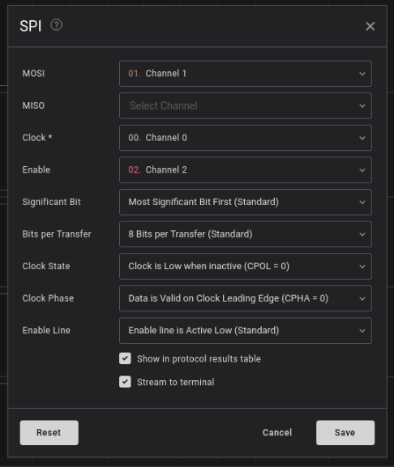
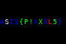

**ASIS CTF Finals 2025**
**Challenge:** Bit Mosaic  
**Category:** Hardware  
**Flag:** `ASIS{P!XX3L5}`  
**Description:** An mosaic display was tapped mid‑story. All we have are some toggles and a promise that the picture is worth the trouble. Let's see what beauty was drawn.

---
This challenge contained a zip with 3 files, a pinmap, a display, and a .sal file.

 


A quick reverse image search revealed that the display was a SSD1351 OLED, and Google provided some useful information about it.



This matched with the pinmap and it was pretty obvious at this point that the tapped display was a SSD1351 OLED.
I analyzed the .sal file a bit more (with the help of ChatGPT :3) revealed that it was using SPI.

I downloaded Saleae's Logic 2 analyzer and created a SPI analyzer with these configurations:



I then exported it as a [txt file](spi.txt).

After doing some more research, I found that 0x5c was the command that writes the ram, and the bytes before that was to be ignored when creating the image. I also found that 0x15 is a command that sets the width of the image, and 0x75 was the command that sets the height of the image.

Using ctrl-f, I found the lines I was looking for in the exported txt file!

```
6.355588041666667,0,0x15,   
6.355716875000000,0,0x00,   
6.355845708333334,0,0x5F,   
6.355974541666667,0,0x75,   
6.356103333333333,0,0x00,   
6.356232166666667,0,0x3F,   
6.356361000000000,0,0x5C,
```

The two 0x00s meant that the image started at (0,0), and 0x5F & 0X3F meant that the image's size was 96x64.

I then used the script below to parse through the txt file and convert the bytes to an image.

```
from PIL import Image

WIDTH  = 96
HEIGHT = 64

data = []
with open("spi.txt") as f:
    for line in f:
        if "0x" in line:
            try:
                b = int(line.split("0x")[1][:2], 16)
                data.append(b)
            except:
                pass

start = data.index(0x5C) + 1

pixel_bytes = data[start : start + WIDTH * HEIGHT * 2]

pixels = []
for i in range(0, len(pixel_bytes), 2):
    p = (pixel_bytes[i] << 8) | pixel_bytes[i + 1]

    r = ((p >> 11) & 0x1F) * 255 // 31
    g = ((p >> 5)  & 0x3F) * 255 // 63
    b = (p & 0x1F) * 255 // 31

    pixels.append((r, g, b))

img = Image.new("RGB", (WIDTH, HEIGHT))
img.putdata(pixels)
img.save("mosaic.png")
```

This was the resulting image I got:



Nice! This gives me the flag `ASIS{P!XX3L5}`.

My team, tjcsc, won 17th place in this ctf, yay!

Thank you for reading my bit-mosaic writeup :D
