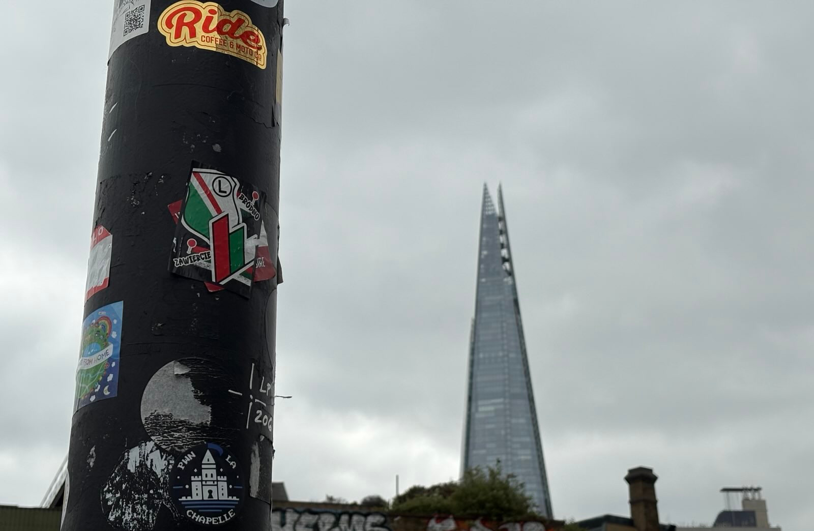
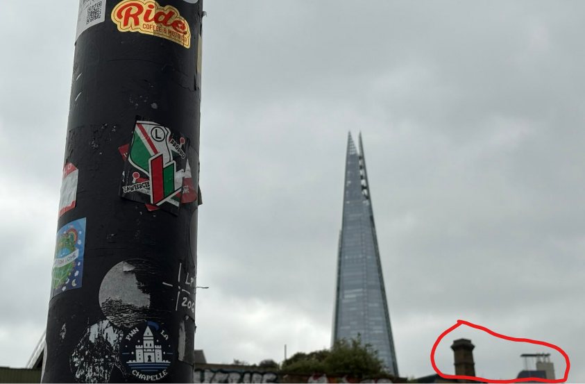
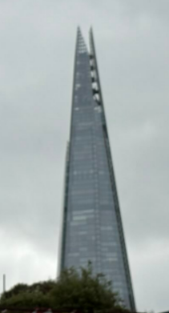
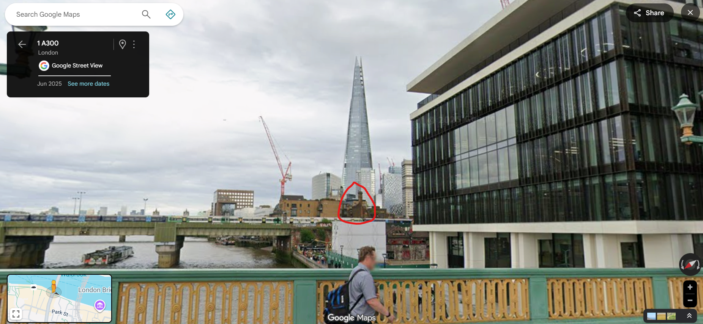
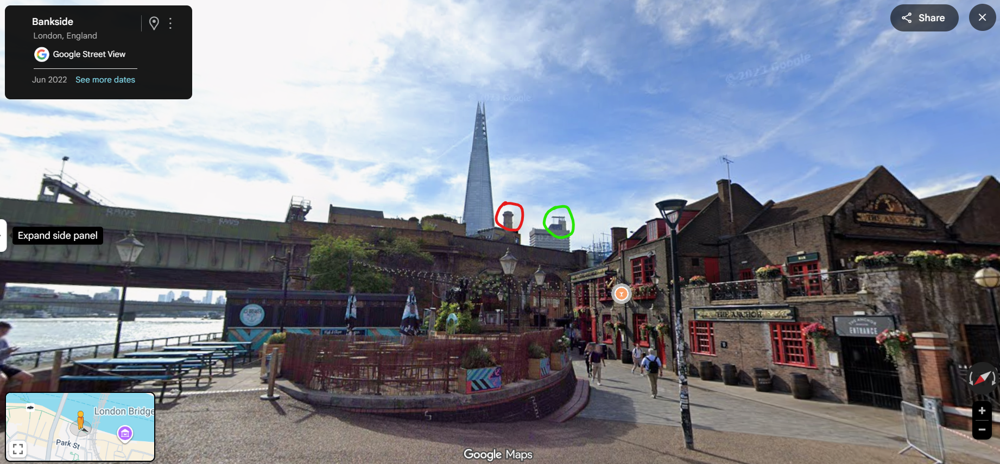
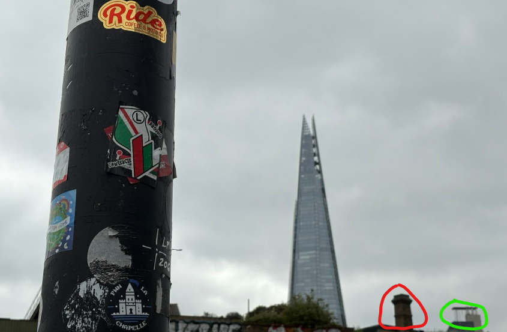

**Haix-la-Chapelle 2025**

I participated with my club team tjcsc in Haix-la-Chapelle 2025, and we got first place! 

**Challenge:** Cool Lamppost  
**Category:** OSINT  
**Flag:** `haix{51.5076_-0.0930}`

---

Initially, I see a lamppost, as mentioned in the title of the challenge. I also see a large building the background. Doing a quick reverse image search of the building, I get these results:

The building looks like The Shard, in London, UK. This certainly narrows things down a lot. Let's look for more distinct features in the given image.

These two things look pretty unique. However, it would still be very hard to search all the buildings nearby The Shard. So let's see if we can narrow things down more.

The angle at which The Shard is shown is useful in narrowing down where we should look. Based on the given perspective, I assumed that the photo was taken not too far from The Shard itself, so that significantly narrowed down the area I needed to search. Also, it looks like the image was taken towards the left of The Shard, so that helps us in reducing the area to search:

I had a feeling that it this was taken close to the river, so I searched there first. Typically, I find it very useful to search around in street view to find any useful landmarks. 

My teammate noticed that on the Southwark Bridge, he could see the small chimney-like stack! We must be getting close to the actual lamppost. After moving around, I noticed this:

There was this bankside area right next to the river. The image given seems like it was taken below the chimney building, and the bankside area is below. It seems very likely that the photo was taken there! Let's get into street view to take a closer look:

It matches perfectly! The two distinct landmarks line up perfectly. Now, we just have to find the exact lamppost, since there are multiple in that area. 

These are the two lampposts that seem likely, and after testing some flags I found that the one circled in red was the same lamppost! This gives us the flag `haix{51.5076_-0.0930}`.

Thank you for reading my write-up! This was a great CTF, and I'd like to give a huge shoutout for the organizers for doing such a good job on organizing their first CTF!

If there's anything you think I could improve on in future write-ups, please let me know! 

Thank you and have a great day!