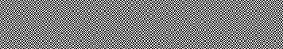
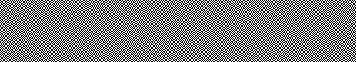
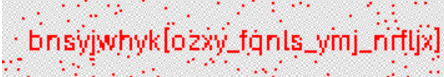

**WinterCTF 2025**

I participated this ctf with a team of four, ddos andrew, and we got 3rd! 

**Challenge:** Double Vision  
**Category:** Forensics  
**Author:** william  
**Flag:** `winterctf{jsxt_align_the_images}`  
**Description:** Line art yields easy readable secrets.

---

The chall provided two very simmilar images, pixels.png, and more_pixels.png

 

The two images were very simmilar, so my first thought was to compare them. I used this [image comparer](https://www.img2go.com/compare-image), which I previously used for another challenge in a different ctf.

The results look very promising! From what I can see, the text read "bnsyjwhyk{oxcy_fqnls_ymj_nrfljx}". After running Dcode's cipher identifier and using Caesar Cipher to shift it five positions, I got "winterctf{jsxt_align_the_images}", which was the flag!
My team ended up being the first team to complete this challenge, nice!

Thank you for reading this writeup!
