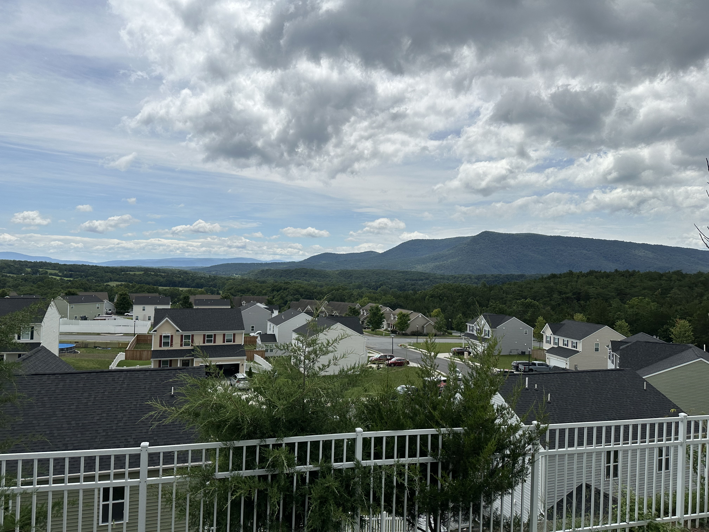
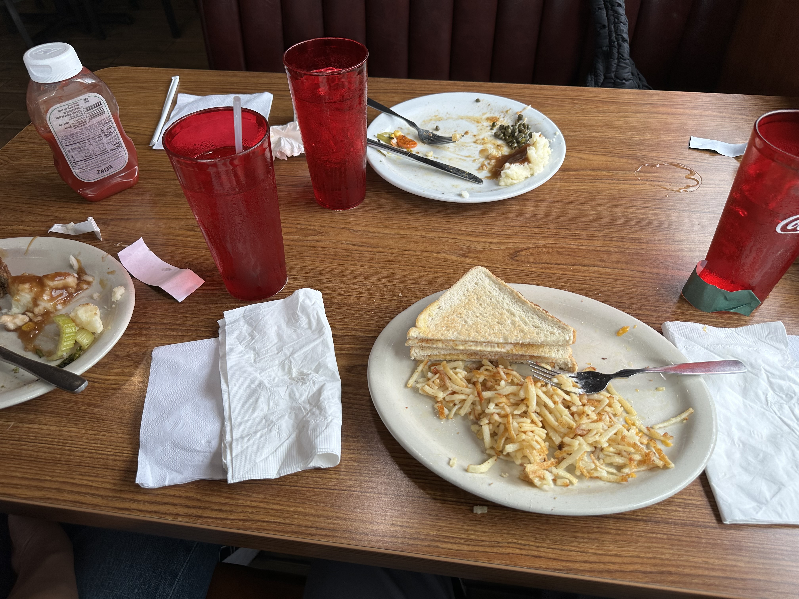
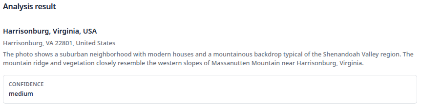
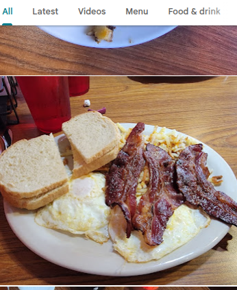
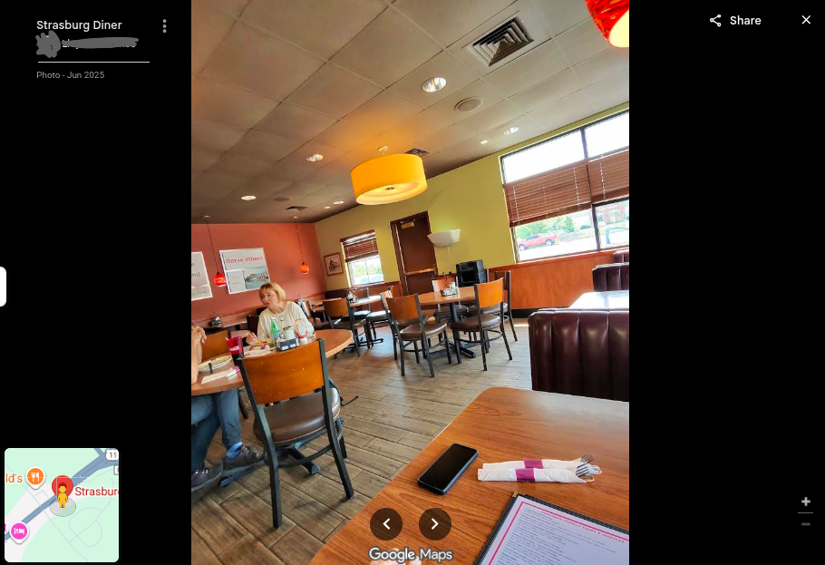
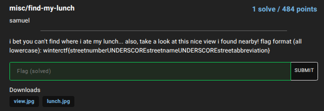

**WinterCTF 2025**

I participated this ctf with a team of four, ddos andrew, and we got 3rd! 

**Challenge:** Find my Lunch  
**Category:** Misc (OSINT)  
**Author:** samuel  
**Flag:** `winterctf{119_hite_ln}`  
**Description:** i bet you can't find where i ate my lunch... also, take a look at this nice view i found nearby! flag format (all lowercase): winterctf{streetnumberUNDERSCOREstreetnameUNDERSCOREstreetabbreviation}

---

This challenge contained two files, one of them was this view, which was taken nearby the restraunt,

and the second one was a picture taken of food inside of the restraunt.

I quickly put the image into an image to location website (whereisthisplace.net) to narrow down the approximate range that I need to search, and recived the following result:

This narrowed the location down to the mountanous regions of Virginia. From there, one of my teammates, [going to sleep](https://ctftime.org/user/243106) analyzed the mountain ranges, and figured the view was someplace near Luray, VA.

The gravy and mashed potato combo of the food closely resembles American comfort food, so I started searching up American restraunts near Luray. After scrolling through Google Maps review images of around a dozen or so restraunts, I stumbled upon Strasburg Diner. 

I immedeatly noticed that they used red Coca-Cola cups, which were in lunch.png, so I kept on digging.

I also found that the seats-sofas that were by the wall closely resembles the color and pattern.

At this point, I was sure about the restrant, so I quickly got the street name (119 Hite Ln, Strasburg, VA 22657) from google maps and plugged it into the flag format.

Yay!! `winterctf{119_hite_ln}` It worked!
Anyways, it turned out that my team was the only one that solved this chall, so that was pretty cool!
This was a really fun ctf, and it taught me a lot, thank you orginizers!

Thanks for reading and have a nice day :D
