**Batman's Kitchen CTF 2026**
**Challenge:** Scryfall Wizard  
**Category:** Misc  
**Author:** Jono  
**Flag:** `bkctf{blockers_is_for_mathing}`  
**Description:** Be a [Scryfall](https://scryfall.com/docs/syntax) wizard today!

---
Scryfall is a search database for Magic: the Gathering cards. The zip file contained 23 images of what I suspected to be screenshots of mtg cards, so I figured that the first step was to identify them. I used a combination of Google image search, Scryfall, and a Magic: the Gathering [symbols guide](https://mtg.fandom.com/wiki/Numbers_and_symbols) to help me find the cards.

1. [Blood Artist](https://scryfall.com/card/jmp/A-206/a-blood-artist)
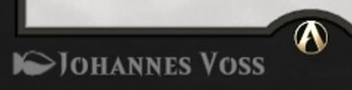
For this one I searched cards with the artist's name on Scryfall and found it.

2. [Lost Mine of Phandelver](https://scryfall.com/card/tafr/21/lost-mine-of-phandelver)
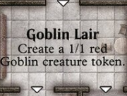
I found this one through a quick google image search.

3. [Our Market Research Shows That Players Like Really Long Card Names So We Made this Card to Have the Absolute Longest Card Name Ever Elemental](https://scryfall.com/card/unh/107/our-market-research-shows-that-players-like-really-long-card-names-so-we-made-this-card-to-have-the-absolute-longest-card-name-ever-elemental)
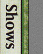
Found this one by using oracle search on the word "Shows"

4. [Chrome Courier](https://scryfall.com/card/brc/123/chrome-courier)
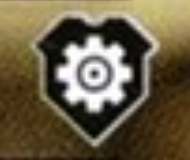
Using Google image search I was able to determine the sybmol meant that the card was in The Brothers' War Commander Decks. I was able to use that information with Scryfall to find the card.

5. [Kudzu](https://scryfall.com/card/lea/204/kudzu)
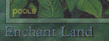
Found this one using google image search.

6. [Eladamri's Call](https://scryfall.com/card/mh1/197/eladamris-call)
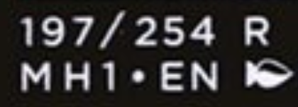
I did a Google search with the card number "197/254" and was able to find it.

7. [Rowan, Scholar of Sparks](https://scryfall.com/card/stx/278/rowan-scholar-of-sparks-will-scholar-of-frost)
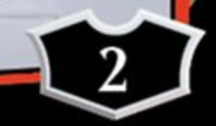
Searched Scryfall with loy=2 (meaning that the loyalty was two) and found a simmilar card. I wasn''t sure if this was the right card because it didn't match competely.

8. [Silver Overlord](https://scryfall.com/card/spg/128/sliver-overlord)
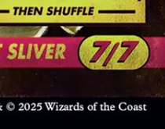
I searched Scryfall with the year 2025 and 7/7 and managed to find it.

9. [Loose Cannon](https://www.pricecharting.com/game/riftbound-origins/jinx-loose-cannon-251)

First card that wasn't mtg! After searching for the two symbols, I was really confused to learn that this card was actually part of Riftbound Orgins instead of Magic the Gathering. I found this card by searching up cards that used the Chaos and Fury rune.

10. [Indicate](https://scryfall.com/card/mb2/501/indicate)
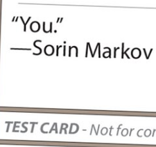
I was lucky enough to have found this early on while looking through a database of test cards.

11. [Sol Ring](https://scryfall.com/card/mkc/237/sol-ring)
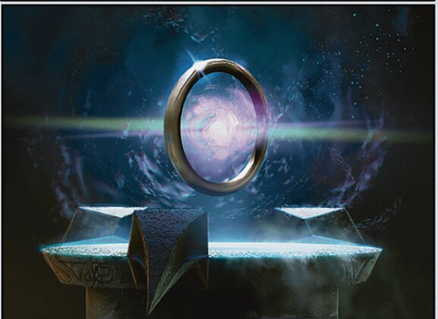
Google image search :D

12. [Effect Veiler](https://www.db.yugioh-card.com/yugiohdb/card_search.action?ope=2&cid=8933)
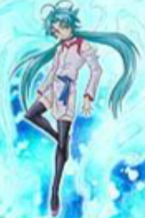
Second card that isn't in mtg. It was another pretty easy Google image search.

13. [False Orders](https://scryfall.com/card/2ed/148/false-orders)
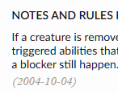
I did some reaserch with the text and the date and found that instead of a screenshot of the card it was a screenshot of the "Notes and Rules Information" on the Scryfall page of the card.

14. idk  :(
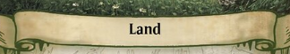
I still havent been able to find this card rip.

15. [Revelation](https://scryfall.com/card/chr/68/revelation)
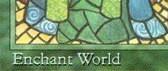
This was yet another quick and easy Google image search.

16. idk #2

I'm not sure if this was to hint towards an underscroll but I was unable to find the source for this screenshot.

17. [Mons's Goblin Waiters](https://scryfall.com/card/unh/82/monss-goblin-waiters)
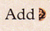
After using the symbols guide, I found that the red semicircle meant half a red mana. Using that and Scryfall I found the card.

18. [Asmoranomardicadaistinaculdacar](https://scryfall.com/card/mh2/186/asmoranomardicadaistinaculdacar)
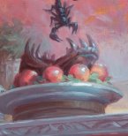
I used Google image search once again, but I had to scroll down quite a bit to find it.

19. [Tamiyo, Seasoned Scholar](https://scryfall.com/card/tmh3/35/tamiyo-seasoned-scholar)

I searched for t:emblem on Scryfall and looked for ones with the same symbol.

20. [Hired Muscle](https://scryfall.com/card/bok/69/hired-muscle-scarmaker)
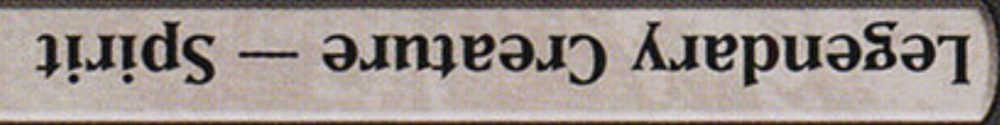
Found this with searching by type again.

21. [Inkmoth Nexus](https://scryfall.com/card/sld/1207/inkmoth-nexus)
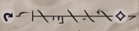
The cipher used in this card was Phyrexian, and I was able to find the card through searching by lang:phyrexian on Scryfall.

22. [Nikara, Lair Scavenger](https://scryfall.com/card/c20/3/nikara-lair-scavenger)
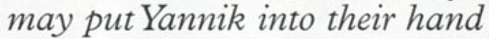
I found the card by searching up the description on Google.

23. [Golos, Tireless Pilgrim](https://scryfall.com/card/m20/226/golos-tireless-pilgrim)
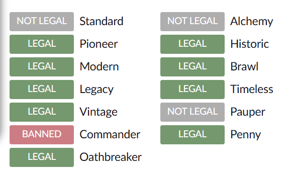
Last card! After already using Scryfall to seach up so many cards, I immedeatly recognized the image as a screenshot of the format legality section of a Scryfall card page. From here I used a bunch of banned:<format> search queries and found a card that matched the image.

By now I had noticed that the first letter of every card seemed to spell something. Putting them together gives "BLOCKERLISSEF_R_MATHING". This matched pretty well with the phrase "Math is for blockers", so by replacing the cards that were not in mtg with and underscroll and guessing the rest of the missing cards I got "BLOCKERS_IS_FOR_MATHING". Putting that into the flag format gave bkctf{blockers_is_for_mathing}, which was the correct flag!

I had a lot of fun solving this challenge (even if it was a little tedious). My team, tjcsc ended up winning first, which was really amazing. Thank you all for reading this writeup and I hope you have a nice day :D 
