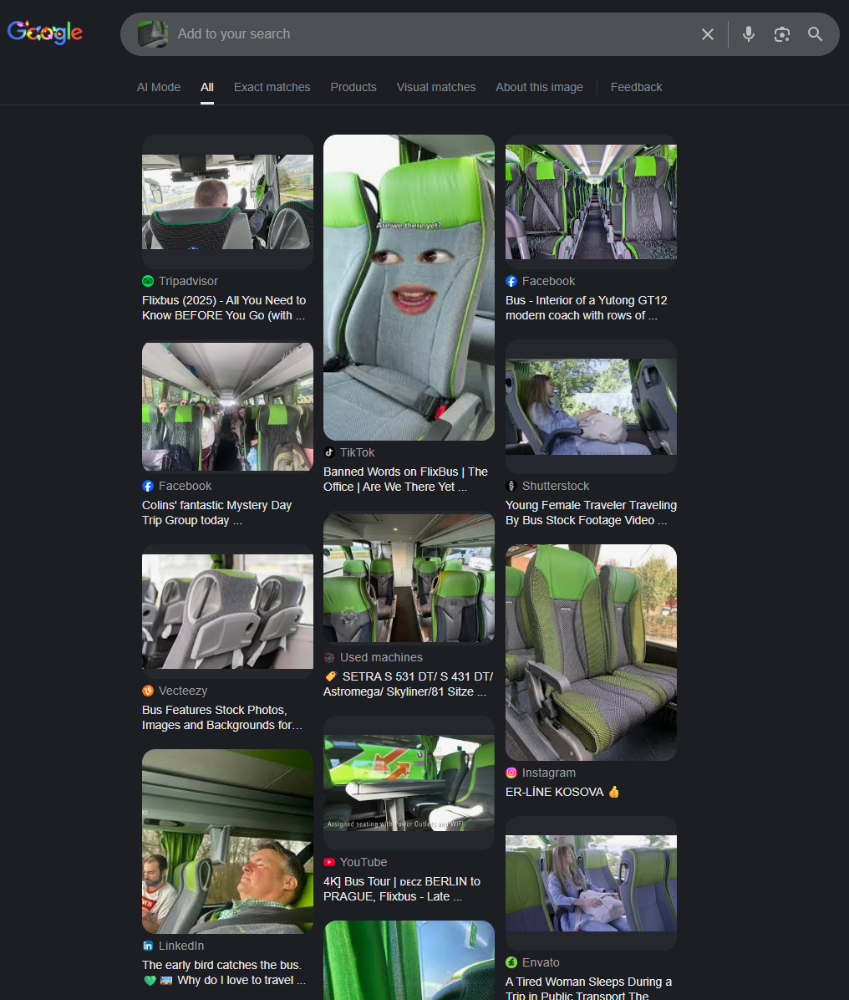
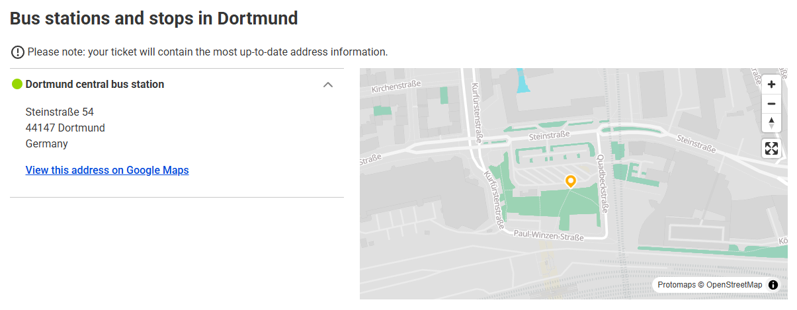
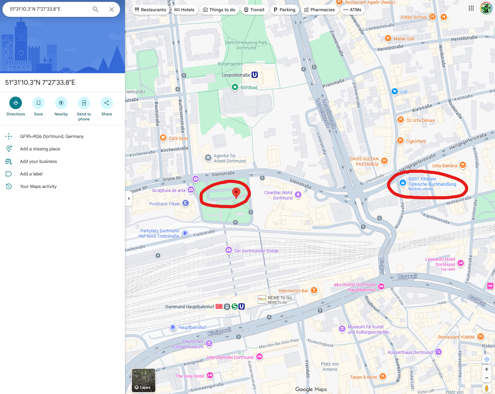
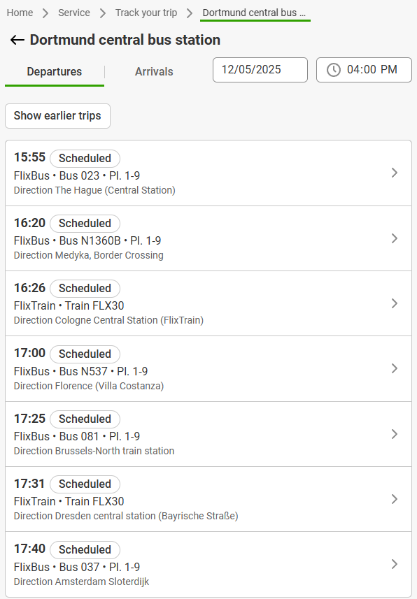

**Haix-la-Chapelle 2025**

I participated with my club team tjcsc in Haix-la-Chapelle 2025, and we got first place! 

**Challenge:** Tiny Blåhaj: curious about the road ahead
**Category:** OSINT  
**Author:** Tschotsch  
**Flag:** `haix{n1360b_medyka}`

---


This challenge is a continuation of the challenge, "Tiny Blåhaj: lost and looking for help", and the files for both are the same. Above is the main file from the previous challenge.

So, in this challenge we need to find the bus line that the image was taken from as well as the final destination. 

The first thing I do with every file is run exiftool. Exiftool is a powerful CLI tool to extract metadata from files, especially for images, videos, and audio files:

```bash
(base) Snowbird91: tiny-blåhaj-curious-about-the-road-ahead$ exiftool haj.jpg
ExifTool Version Number         : 12.76
File Name                       : haj.jpg
Directory                       : .
File Size                       : 3.3 MB
File Modification Date/Time     : 2025:11:21 09:53:19-05:00
File Access Date/Time           : 2025:12:01 15:04:30-05:00
File Inode Change Date/Time     : 2025:12:01 13:40:59-05:00
File Permissions                : -rwxrwxrwx
File Type                       : JPEG
File Type Extension             : jpg
MIME Type                       : image/jpeg
Exif Byte Order                 : Little-endian (Intel, II)
Resolution Unit                 : inches
Image Description               :
Make                            : Nothing
Camera Model Name               : A142
Software                        : MediaTek Camera Application
Orientation                     : Horizontal (normal)
Modify Date                     : 2025:10:24 16:24:33
Y Cb Cr Positioning             : Co-sited
Maker Note Unknown Text         : (Binary data 172 bytes, use -b option to extract)
Recommended Exposure Index      : 0
Sensitivity Type                : Unknown
ISO                             : 100
Exposure Program                : Program AE
F Number                        : 1.9
Exposure Time                   : 1/217
Sub Sec Time Digitized          : 374
Offset Time Digitized           : +02:00
Sub Sec Time Original           : 374
Offset Time Original            : +02:00
Sub Sec Time                    : 374
Offset Time                     : +02:00
Focal Length                    : 5.6 mm
Flash                           : No Flash
Light Source                    : Other
Metering Mode                   : Center-weighted average
Scene Capture Type              : Standard
Interoperability Index          : R98 - DCF basic file (sRGB)
Interoperability Version        : 0100
Focal Length In 35mm Format     : 0 mm
Max Aperture Value              : 1.9
Create Date                     : 2025:10:24 16:24:33
Exposure Compensation           : 0
Digital Zoom Ratio              : 1
Exif Image Height               : 4080
White Balance                   : Auto
Date/Time Original              : 2025:10:24 16:24:33
Brightness Value                : 5.1
Exif Image Width                : 3072
Exposure Mode                   : Auto
Aperture Value                  : 1.9
Components Configuration        : Y, Cb, Cr, -
Color Space                     : sRGB
Shutter Speed Value             : 1/217
Exif Version                    : 0220
Flashpix Version                : 0100
X Resolution                    : 72
Y Resolution                    : 72
Thumbnail Offset                : 1290
Thumbnail Length                : 27880
Compression                     : JPEG (old-style)
XMP Toolkit                     : Adobe XMP Core 5.1.2
Version                         : 1.0
Directory Item Semantic         : Primary
Directory Item Mime             : image/jpeg
Directory Item Length           : 39351
Profile CMM Type                :
Profile Version                 : 4.3.0
Profile Class                   : Display Device Profile
Color Space Data                : RGB
Profile Connection Space        : XYZ
Profile Date Time               : 2025:10:24 14:24:35
Profile File Signature          : acsp
Primary Platform                : Unknown ()
CMM Flags                       : Not Embedded, Independent
Device Manufacturer             : Google
Device Model                    :
Device Attributes               : Reflective, Glossy, Positive, Color
Rendering Intent                : Perceptual
Connection Space Illuminant     : 0.9642 1 0.82491
Profile Creator                 : Google
Profile ID                      : 61473528d5aaa311e143dfc93efaa268
Profile Description             : Display P3 Gamut with sRGB Transfer
Red Matrix Column               : 0.51512 0.2412 -0.00104
Green Matrix Column             : 0.29198 0.69225 0.04189
Blue Matrix Column              : 0.1571 0.06657 0.78407
Media White Point               : 0.9642 1 0.82491
Media Black Point               : 0 0 0
Red Tone Reproduction Curve     : (Binary data 40 bytes, use -b option to extract)
Green Tone Reproduction Curve   : (Binary data 40 bytes, use -b option to extract)
Blue Tone Reproduction Curve    : (Binary data 40 bytes, use -b option to extract)
Chromatic Adaptation            : 1.04788 0.02292 -0.05019 0.02959 0.99048 -0.01704 -0.00922 0.01508 0.75168
Profile Copyright               : Copyright (c) 2023 Google Inc.
MPF Version                     : 0100
Number Of Images                : 2
MP Image Flags                  : (none)
MP Image Format                 : JPEG
MP Image Type                   : Undefined
MP Image Length                 : 39351
MP Image Start                  : 3261193
Dependent Image 1 Entry Number  : 0
Dependent Image 2 Entry Number  : 0
Image Width                     : 3072
Image Height                    : 4080
Encoding Process                : Baseline DCT, Huffman coding
Bits Per Sample                 : 8
Color Components                : 3
Y Cb Cr Sub Sampling            : YCbCr4:2:0 (2 2)
Aperture                        : 1.9
Image Size                      : 3072x4080
Megapixels                      : 12.5
Shutter Speed                   : 1/217
Create Date                     : 2025:10:24 16:24:33.374+02:00
Date/Time Original              : 2025:10:24 16:24:33.374+02:00
Modify Date                     : 2025:10:24 16:24:33.374+02:00
Thumbnail Image                 : (Binary data 27880 bytes, use -b option to extract)
MP Image 2                      : (Binary data 39351 bytes, use -b option to extract)
Focal Length                    : 5.6 mm
Light Value                     : 9.6
(base) Snowbird91: tiny-blåhaj-curious-about-the-road-ahead$
```

Ahh, interesting! We have some useful data here. The date and time the picture was taken is October 24th, 2025 at 16:24. This is very important for finding the exact bus route!

The bus company is FlixBus. I have actually been on one of their busses before, but a simple reverse image search confirms this:



If we go to FlixBus's [website](https://global.flixbus.com/track?panelVisible=true), we can see a page dedicated for departures and arrivals at a specific location. Now, this begs a question. Is the bus arriving, or departing?

Going to the [Dortmund](https://global.flixbus.com/bus/dortmund) page, we can see the exact location of the bus station:



We can tell if the bus is departing or arriving based on the direction the bus is driving in the original picture. We can see that the bus is driving **toward** the book store, and using Google Maps:



We can tell that it is driving away from the bus station, meaning it must be departing.

I searched for departures from the Dortmund central bus station. Knowing that October 24th, 2025 was a Friday, I picked a Friday in the future to make sure that the bus route I was looking for would be active. Since I knew the picture was taken at 16:24 and that the location the picture was taken was not too far from the bus station, I knew the departure time was probably a few minutes before the picture was taken.

This is why I selected December 5th, 2025 (a Friday) as the date and 4:00 PM (16:00) as the time. Searching gave these results:



Great! I see one route that seems to fit. FlixBus N1360B departing at 16:20 headed to Medyka. Let's try that flag...

Perfect! `haix{n1360b_medyka}` worked and was the flag.

Thank you for reading my write-up! This was a great CTF, and I'd like to give a huge shoutout for the organizers for doing such a good job on organizing their first CTF!

If there's anything you think I could improve on in future write-ups, please let me know! 

Thank you and have a great day!