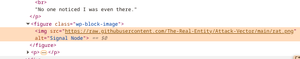
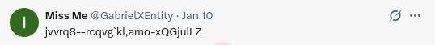
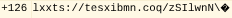
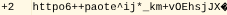
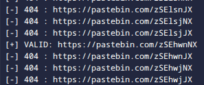
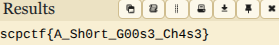

**SCPCTF 2025**
**Challenge:** Vector Attack  
**Category:** OSINT  
**Flag:** `scpctf{A_Sh0rt_G00s3_Ch4s3}`  

---
This challenge started with a RAR file, which had a video in it.

<video width="640" controls>
  <source src="./vectorstart.mp4" type="video/mp4">
</video>


The circles and rectangled looked like morse code, so after slowing down a ton, I mapped frames with the circle as "." and frames with the rectagle as "-", using the completely black frames as seperators.
This resulted in "-.-. - ..-. ..... .-.-.- .-- --- .-. -.. .--. .-. . ... ... .-.-.- -.-. --- --", which when decoded gave "[CTF5.WORDPRESS.COM](CTF5.WORDPRESS.COM)".

The website was an article, which included an image of an AI-generated rat and a hint that "Everything you need is already in the picture." 

 

I decided to download the image, but after running some basic steg and not finding anything significant, I returned to the website. This time, after messing with the source code for a bit I found that the image was from Github.

 

Searching up the Github account and repository gave [https://github.com/The-Real-Entity/Attack-Vector](https://github.com/The-Real-Entity/Attack-Vector). The repo also contained snowyclues.rar, and after opening that I found diamond.png, which was just ordinary text but with a png file extention. 

The text read "c2ysVNG6W6QhGPPhhqYWCY1". Dcode identified that it was base58, and decoded it into "@GabrielXEntity". From there, using IDCrawl I found the twitter profile [https://x.com/GabrielXEntity](https://x.com/GabrielXEntity).

The accound had one post,



After plugging the string "jvvrq8--rcqvg`kl,amo-xQGjulLZ" into Dcode's cipher identifier once again, I found that it was a variant of ASCII shift. 

These ASCII shift encoding methods -2 and +2 combined together roughly gave "https://pastebin.com/", and I figured that the eight digit pastebin code was also a combination of those two.




Since there was no concrete pattern I could see from the first half of the url (+2,+2,+2,+2,-2,-2,-2,-2,+2,+2,-2,+2,+2,-2,+2,-2,-2,-2,-2,+2), I decided to bruteforce the second portion.

I used this script to bruteforce,


```
#!/usr/bin/env python3
import re
import string
import requests

s1 = "lxxts://tesxibmn.coq/zSIlwnN\\"
s2 = "httpo6++paote^ij*_km+vOEhsjJX"

# ---- CONFIG ----
ALLOWED = string.ascii_letters + string.digits + ":/.?-_"
ID_LEN = 8
TIMEOUT = 4
# ----------------

# pad for alignment
L = max(len(s1), len(s2))
s1 = s1.ljust(L)
s2 = s2.ljust(L)

pattern = re.compile(r"https?://pastebin\.com/([A-Za-z0-9]{%d})" % ID_LEN)

results = set()

def dfs(i, buf):
    if i == L:
        text = "".join(buf)
        m = pattern.search(text)
        if m:
            url = m.group(0)
            if url not in results:
                try:
                    r = requests.get(url, timeout=TIMEOUT)
                    if r.status_code != 404:
                        print("[+] VALID:", url)
                        results.add(url)
                    else:
                        print("[-] 404 :", url)
                except Exception as e:
                    print("[!] Error checking", url, e)
        return

    opts = []
    if s1[i] in ALLOWED:
        opts.append(s1[i])
    if s2[i] in ALLOWED and s2[i] != s1[i]:
        opts.append(s2[i])

    if not opts:
        dfs(i+1, buf)
        return

    for o in opts:
        buf.append(o)
        dfs(i+1, buf)
        buf.pop()

dfs(0, [])

print("\nFinal valid URLs:")
if results:
    for u in results:
        print(u)
else:
        print("None found")
```


And found the only valid url, "[https://pastebin.com/zSEhwnNX](https://pastebin.com/zSEhwnNX))".



The pastebin had the text "I5RFQYKKGJYDOQRRKJ4VO3TDNF2TG4DFNNDWGNCSNUZXE5LFOJTGMTSRPJYA====". Identifying and decoding it with base32 gave the string "GbXaJ2p7B1RyWnciu3pekGc4Rm3ruerffNQzp". From there I used Dcode's cipher identifier once again and decoded it with base58.



Yay! `scpctf{A_Sh0rt_G00s3_Ch4s3}` The flag finally showed up!
This challenge was actually a really fun challenge and it taught me a lot! Personally, I would probably assign a few more points for this chall, because of the sheer amount of content, but otherwise, it was great, and thank you disavowed913 for creating it!

I ended up placing 5th in this ctf, which is really cool :)

I hope you enjoyed my writeup :D


