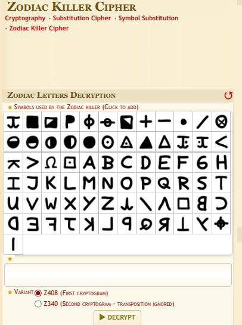
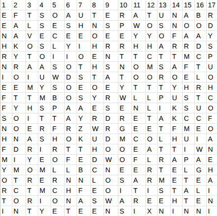
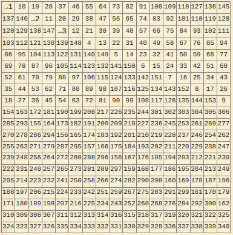
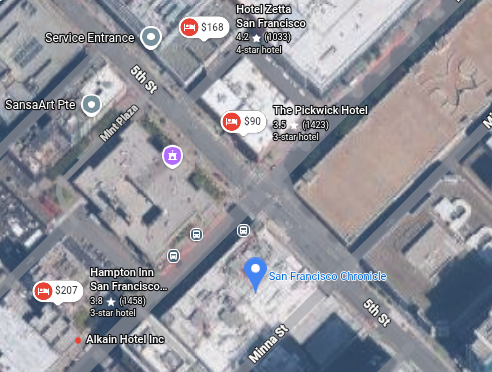

**DawgCTF 2026**
**Challenge:** What's your Zodiac Sign?  
**Category:** Crypto  
**Author:** Takumi  
**Flag:** `DawgCTF{pickwick_hotel}`  
**Description:** I was looking through [the archive](https://github.com/UMBCCyberDawgs/dawgctf-sp26/tree/main/Whats%20your%20Zodiac%20Sign) of the Albin O. Kuhn Library when I spotted a peculiar looking document in one of the many dusty boxes containing mysterious artifacts of the past. It seemed to be some kind of cipher, accompanied by an alphabet of characters related to various star symbols and Zodiac signs. I couldn't figure it out on my own. Can you help me uncover this decades old mystery?  

---
A PDF was provided with Zodiac and Astrology symbols. My first instinct was to search up if there were any Zodiac-themed ciphers, and found the [Zodiac killer cipher](https://www.dcode.fr/zodiac-killer-cipher) on Dcode:

  

Since the symbols didn’t match I didn’t look into it more at the time.

Going back to the pdf, the first page was a substitution key with A-Z and all the symbols that appeared on the 17x20 grid in the second page. Having no other better idea of what to do, I started to translate the symbols into letters. It resulted in this grid:

  

At first, I thought that this might be some sort of word search puzzle after finding the word “orion”, but I scrapped that idea after discovering no other relevant words. I decided to use the hint, which hinted to the amount of letters in the ciphertext. The grid had 340 letters, which I realized was one of the versions of the Zodiac killer cipher I saw earlier on Dcode. After doing more research into the cipher I found that the second zodiac killer cipher was a real encoded message consisting of both a transposition and a homophonic cipher in a 17x20 grid of symbols. My grid was already decoded into letters so I figured that only the transposition part would be applied. Dcode helpfully provided a transposition grid for the cipher.

  

To unscramble the letters, I used this script

```
order = [
[1,10,19,28,37,46,55,64,73,82,91,100,109,118,127,136,145],
[137,146,2,11,20,29,38,47,56,65,74,83,92,101,110,119,128],
[120,129,138,147,3,12,21,30,39,48,57,66,75,84,93,102,111],
[103,112,121,130,139,148,4,13,22,31,40,49,58,67,76,85,94],
[86,95,104,113,122,131,140,149,5,14,23,32,41,50,59,68,77],
[69,78,87,96,105,114,123,132,141,150,6,15,24,33,42,51,60],
[52,61,70,79,88,97,106,115,124,133,142,151,7,16,25,34,43],
[35,44,53,62,71,80,89,98,107,116,125,134,143,152,8,17,26],
[18,27,36,45,54,63,72,81,90,99,108,117,126,135,144,153,9],
[154,163,172,181,190,199,208,217,226,235,244,301,302,303,304,305,306],
[285,293,155,164,173,182,191,200,209,218,227,236,245,253,261,269,277],
[270,278,286,294,156,165,174,183,192,201,210,219,228,237,246,254,262],
[255,263,271,279,287,295,157,166,175,184,193,202,211,220,229,238,247],
[239,248,256,264,272,280,288,296,158,167,176,185,194,203,212,221,230],
[222,231,240,257,265,273,281,289,297,159,168,177,186,195,204,213,249],
[205,214,223,232,241,250,258,266,274,282,290,298,160,169,178,187,196],
[188,197,206,215,224,233,242,251,259,267,275,283,291,299,161,170,179],
[171,180,189,198,207,216,225,234,243,252,260,268,276,284,292,300,162],
[310,309,308,307,311,312,313,314,316,315,318,317,319,320,321,322,325],
[324,323,327,326,335,334,333,332,331,330,329,328,336,337,338,339,340]
]

letters = [
list("EFTSOAUTERATUNABR"),
list("EALSESHNSPWOSNOOD"),
list("NAVECEEOEEYYOFAAY"),
list("HKOSLYIHRRHHARRDS"),
list("RYTOIIOENTTCTTMCP"),
list("NRAASOTHSNOMSAFTU"),
list("IOIUWDSTATOOROELO"),
list("EEMYSOEOEYTTTYHRH"),
list("FTTMBOSYRWLLPUSTC"),
list("FYHSPAAESENLIKSUO"),
list("SOITTAYRDRETAKCCF"),
list("NOERFRZWRGEETFMEO"),
list("HNASHOKUDMCOLHUIA"),
list("FDRIRTTHOOEATTIWN"),
list("MIYEOFEDWOFLRAPAE"),
list("YMOMLLBCNEERTELGH"),
list("OTRERNNLOSARMETEA"),
list("RCTMCHFEOITISTALI"),
list("TORIONASWAREEHTEN"),
list("INTYETEENSIXNINNI")
]

# map number -> letter
pos = {}
for r in range(20):
    for c in range(17):
        pos[order[r][c]] = letters[r][c]

# build message
message = "".join(pos[i] for i in range(1,341))
print(message)
```

Which resulted in “ELCINORHCFSEHTMORFTEERTSEHTSSORCALETOHEHTFOEMANEHTTIMBUSYAMUOYOTPYRCNISSEWORPRUOYROFDRAWERASASYADOWTNAHTSSELUOYKOOTYLNONOITATPADASIHTTUBEVLOSOTSRAEYENOYTFIFKOOTTIYTRUOFEERHTZDELLACSAWMARGOTPYRCTAHTMARGOTPYRCADELIAMEHEREHWMORFSETUNIMNEETFIFYLNONAMADELLIKEHREBOTCONIOCSICNARFNASFOSTEERTSEHTDEMAOROHWRELLIKSUOIROTONASAWEREHTENINYTXISNEETENINNI”. I was a little bit worried at first that I messed up somewhere because it looked like gibberish, but I decided to plug it into Dcode’s cipher identifier just in case and decoded it with [Latin Gibberish](https://www.dcode.fr/latin-gibberish) into “NINETEENSIXTYNINETHEREWASANOTORIOUSKILLERWHOROAMEDTHESTREETSOFSANFRANCISCOINOCTOBERHEKILLEDAMANONLYFIFTEENMINUTESFROMWHEREHEMAILEDACRYPTOGRAMTHATCRYPTOGRAMWASCALLEDZTHREEFOURTYITTOOKFIFTYONEYEARSTOSOLVEBUTTHISADAPTATIONONLYTOOKYOULESSTHANTWODAYSASAREWARDFORYOURPROWESSINCRYPTOYOUMAYSUBMITTHENAMEOFTHEHOTELACROSSTHESTREETFROMTHESFCHRONICLE”.

"Nineteen sixty nine there was a notorious killer who roamed the streets of San Francisco in October he killed a man only fifteen minutes from where he mailed a cryptogram that cryptogram was called z three fourty it took fifty one years to solve but this adaptation only took you less than two days as a reward for your prowess in crypto you may submit the name of the hotel across the street from the SF Chronicle"

Yipee!

I quickly located the San Francisco Chronicle on Google Maps and searched for nearby hotels.

  

The hotel right across the street was The Pickwick Hotel, and the flag DawgCTF{pickwick_hotel} worked!

This is possibly the most fun I’ve ever had with a ctf cryptology challenge and it taught me a lot :D Thank you so much to Takumi for creating such a creative challenge and thank you all for reading my writeup!
